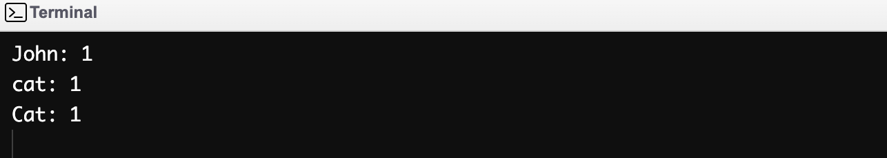

# findNeedles() API Documentation

## Overview
`findNeedles(String haystack, String[] needles);` is an API method that can search up to five words from an input string array and count the number of occurrences for each word within the input string.

| Input Variable | Description | Example |
|---|---|---|
| `haystack` | Any string of text of any length. | "This is a test string." |
| `needles` | An array of word strings. These words are the search arguments. | {"Search", "test", "hello"} |

The input `haystack` string will be split based on if the string contains the following characters:

* ` \` Blank space character
* `\"` Double quotes character  
* `\'` Single quote character  
* `\t` Tab space character  
* `\n` New line character  
* `\b` Back space character  
* `\f` Form feed character  
* `\r` Carriage return character

## Calling the Method
To call the method, you would need an input string `haystack` and an input string array `needles`.

Example:
```
String haystack = "This is an example string!";
String[] needles = {"example","here","string"};
findNeedles(haystack, needles);`
```

## Limitations
* This method can only search up to five words. Anything more would surface the message "Too many words!"
* The method input arguments are case sensitive. If you search for the word `happy` and the string contains the text `"Happy to see you!"`, the method would output `happy: 0`.
* For inputs that contains punctuation, the method recognizes them as different words. For example, `Greetings` and `Greetings!` are considered two seperate words.
* The method does not recognize phrases, so the search words must be singular.
* The method does not recognize duplicate search strings. For example, if you have the array `{"cat", "dog", "cat"}` to search within the string `"John has a cat"`, the method would return a seperate count for each `cat` in the search array. The output:
`cat: 1
dog: 0
cat: 1`


## Test Cases
We have a variety of test cases to show some outputs and limitations.

## Case #1

```
String haystack = "Sam loves green eggs and ham";
String[] needles = {"Sam","loves","free","donuts"};
findNeedles(haystack, needles);
```

**Console Output**


### Case #2
```
String haystack = "Rise and shine, it's morning time";
String[] needles = {"xhbau","times","rise","shine"};
findNeedles(haystack, needles);
```
**Console Output**


### Case #3
```
String haystack = "I'm happy to be here";
String[] needles = {"I", "live", "here"};
findNeedles(haystack, needles);
```
**Console Output**


### Case #4
```
String haystack = "Happy to be in San Francisco";
String[] needles = {"22","live","8","in","xyz","8129"};
findNeedles(haystack, needles);
```
**Console Output**


### Case #5
```
String haystack = "John Doe has a cat named Cat";
String[] needles = {"John", "cat", "Cat"};
findNeedles(haystack, needles);
```
**Console Output**

